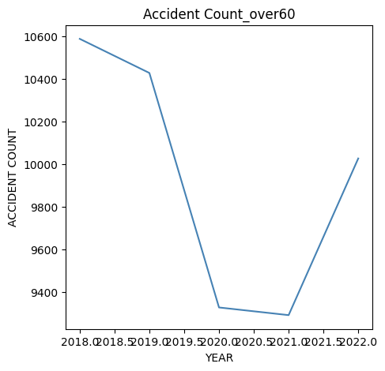

# 프로젝트 기획안🚀

## 1. 개요

 본 프로젝트는 서울시의 교통 안전 및 자전거 교통사고 현황을 분석하고, 이를 바탕으로 플레이데이터 서초캠퍼스 데이터엔지니어 31기 수강생들을 대상으로, 안전 운전 및 교통사고 인식 제고를 목표로 함.

## 2. 범위

* 지난 3주 간 강의 시간에 배운 내용을 바탕으로, 웹크롤링, 데이터베이스 구축, 데이터 분석 및 시각화 기술을 이용하여, 프로젝트를 수행
* 모든 팀원들이 강의 시간에 배운 내용을 다 활용해보고 서로 구현 코드를 비교해 보는 방식으로 프로젝트 수행

## 3. 목표

* 서울시의 교통사고 발생 패턴을 분석하고, 시각화하여 안전 운전에 대한 인식 제고
* 특히, 다양한 요인에 따른 교통사고, 발생 패턴을 분석하고, 자전거 이용량과 교통사고 발생 사이의 상관관계 파악

## 4. 데이터 수집 및 전처리

### 1. 데이터 수집

  1.  서울시 교통사고 현황에 대한 유형별 5년치 데이터(2018-2022년도 자료)
      * 데이터 원천 : [교통안전정보관리시스템](https://tmacs.kotsa.or.kr/)
      * 사용 기술 : " BeautifulSoup4 " Library
      * 수집 내역 : 차량별 사고 수를 상세 조회하여, 위반유형별, 사고유형별, 기상상태별, 도로형태별, 운전경력별, 연령대별에 대한 정보 수집
  2. 서울시 공공자전거 이용 내역에 대한 5년치 데이터(2018-2022년도 자료)
      * 데이터 원천 : [서울시 공공자전거 이용정보(월별)](https://data.seoul.go.kr/dataList/OA-15248/F/1/datasetView.do), [서울시 공공자전거 대여소 정보](https://data.seoul.go.kr/dataList/OA-13252/F/1/datasetView.do)
      * 사용 기술 : 
          1. 해당 홈페이지에서 첨부된 파일을 다운로드 받아 파일을 읽기 위한 pandas코드 작성
          2. openAPI를 불러오기 위해 파이썬 코드 작성
      * 수집 내역 : 각 구별 공공 자전거 이용 건수와 대여소 위치 정보를 각각 수집

### 2. 데이터 전처리

#### 1. 진행내역
  1. 시도 및 구군 리스트 추출 진행
      * 이슈 : Selenium 구동환경 구축 미흡으로 인한 오류 발생❗
        > 해결 : 지자체 코드 리스트 수기 생성 ☑️
  2. 데이터프레임 병합 진행
      * 이슈1 : 병합 시 인덱스 오류 발생❗
        > 해결 : `reset_index(drop=True)`로 해결✅
      * 이슈2 : 데이터파일 확장명 상이(폴더 내 csv와 excel파일 동시 존재)
        > 해결 : `read_csv()`와 `read_xlsx()` 각각 적용하여 해결✅
      * 이슈3 : 데이터프레임 내 년도 및 유형명 누락
        > 해결 : `df['YEAR']=year_list[y]`, `df[BASE_CATEGORY]=’사고유형’`으로 해결✅
      * 이슈4 : 파일별 컬럼명 및 속성값 상이
        > 해결 : `df.rename()`, `df.replace()`로 해결✅

## 5. 데이터베이스 구축

* pymysql을 이용하여 공유 서버에 데이터베이스 연결
* 수집한 데이터를 기반으로 스타스키마 기반의 데이터베이스 구축
  > 
* 데이터베이스 테이블은 교통사고 유형, 공공자전거 이용량 포함

## 6. 데이터 분석 및 시각화
### 1. 데이터 시각화를 통한 분석 의의
  * 통계치만으로 파악할 수 없는 것들을 시각화를 통해 직관적으로 파악하여 

### 2. 사용 그래프 
  * Bar Chart : 지자체별 자전거 누적사고건수를 확인하기 위해 사용
    > 
  * Line Chart : 시간의 흐름에 따른 사고건수 확인을 위해 사용
    > 
  * Stack Chart : 사고유형별 사고발생건수와 시간대별 비율을 직관적으로 파악하기 위해 사용
    > 
  * Pie Chart : 지자체별 사고발생 비율을 직관적으로 파악하기 위해 사용
    > 
  * Heatmap : 지자체별 공공자전거 이용률 변화에 따른 자전거 사고율의 관계를 찾기 위해 사용
    > 
  * Geographical map : 지자체별 자전거 누적사고건수를 직관적으로 파악하기 위해 사용
    > 

## 7. 결론
### 1. 

### 2. 아쉬운 점

### 3. 더 나아가

[공공자전거 이용률](image/nums_of_rent_by_gugun.png)
image/지자체별사고유형별자전거누적사고건수그래프.png
...

## 7. 레퍼런스

* [교통안전정보관리시스템](https://tmacs.kotsa.or.kr/)
* [서울시 열린 데이터 광장 통계목록 - 서울시차량통행속도실태조사](https://data.seoul.go.kr/dataService/boardList.do)
* [서울시 공공자전거 이용현황](https://data.seoul.go.kr/dataList/OA-14994/F/1/datasetView.do) : 렁우렁우님이 API 키 발급 받음. 
* [서울시 공공자전거 이용정보(월별)](https://data.seoul.go.kr/dataList/OA-15248/F/1/datasetView.do)
* [서울시 공공자전거 대여소 정보](https://data.seoul.go.kr/dataList/OA-13252/F/1/datasetView.do)
* [GitHub - repository](https://github.com/pladata-encore/DE31-1st-traffic_survey)
* [서울시 자전거도로 현황 통계](https://data.seoul.go.kr/dataList/276/S/2/datasetView.do)